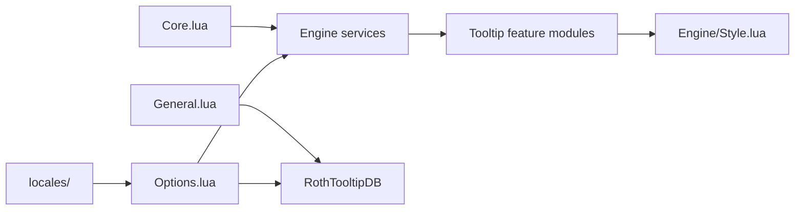

# Code graph

```mermaid
flowchart LR
  Core[Core.lua] --> Engine[Engine services]
  General[General.lua] --> DB[RothTooltipDB]
  Engine --> Modules[Tooltip feature modules]
  Modules --> Style[Engine/Style.lua]
  Options[Options.lua] --> DB
  Options --> Engine
  Locales[locales/] --> Options
```
