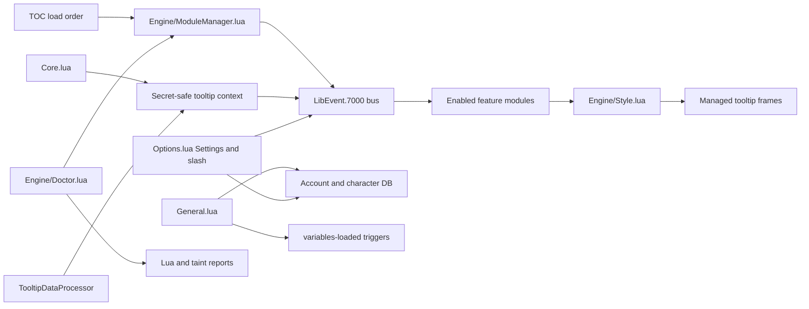

# Code graph

```mermaid
flowchart LR
  TOC[TOC load order] --> MM[Engine/ModuleManager.lua]
  MM --> Bus[LibEvent.7000 bus]
  Core[Core.lua] --> Context[Secret-safe tooltip context]
  TDP[TooltipDataProcessor] --> Context
  Context --> Bus
  General[General.lua] --> DB[Account and character DB]
  General --> Vars[variables-loaded triggers]
  Bus --> Modules[Enabled feature modules]
  Modules --> Style[Engine/Style.lua]
  Style --> Tooltips[Managed tooltip frames]
  Options[Options.lua Settings and slash] --> DB
  Options --> Bus
  Doctor[Engine/Doctor.lua] --> MM
  Doctor --> Errors[Lua and taint reports]
```
