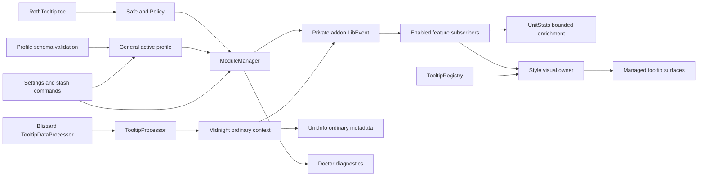

# Code graph

```mermaid
flowchart LR
  TOC[RothTooltip.toc] --> Safe[Safe and Policy]
  Safe --> MM[ModuleManager]
  MM --> Bus[Private addon.LibEvent]
  Blizzard[Blizzard TooltipDataProcessor] --> Processor[TooltipProcessor]
  Processor --> Context[Midnight ordinary context]
  Context --> Bus
  Profile[Profile schema validation] --> General[General active profile]
  General --> MM
  Context --> UnitInfo[UnitInfo ordinary metadata]
  Modules --> Stats[UnitStats bounded enrichment]
  Options[Settings and slash commands] --> MM
  Options --> General
  Bus --> Modules[Enabled feature subscribers]
  Modules --> Style[Style visual owner]
  Registry[TooltipRegistry] --> Style
  Style --> Tooltips[Managed tooltip surfaces]
  MM --> Doctor[Doctor diagnostics]
```

This is a responsibility map, not a proof of runtime access. See [architecture](ARCHITECTURE.md) and [validation limits](tests/README.md).
